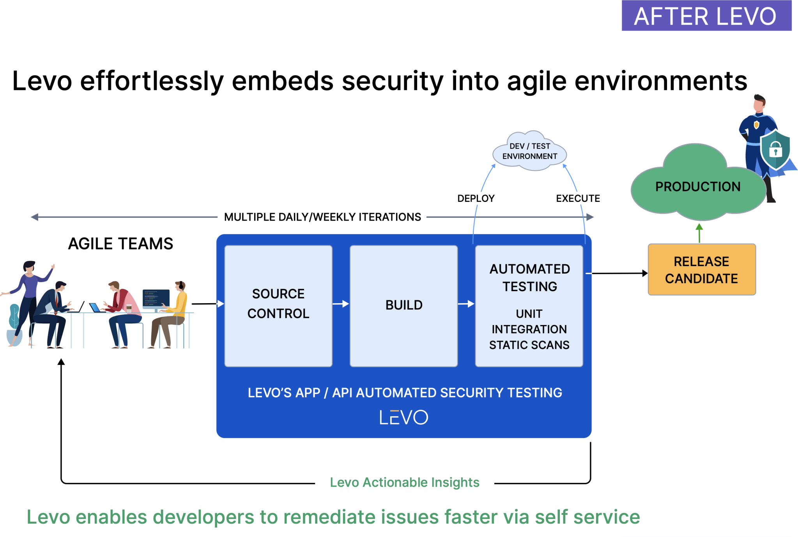

# Welcome to Levo!
Levo empowers modern development teams to build reliable, resilient, and secure APIs.

------

### What value does Levo provide?

#### For Developers
- Automatically test all API endpoints for conformance to their OpenAPI Schemas.
- Ensure that the API implementation matches their specification.
- Prevent breaking changes from impacting API deployments in production.
- Ship regression free APIs to customers and partners.
- Do all of the above in CI/CD.

#### For Security Engineering
- Automatically test all API endpoints for comprehensive security vulnerabilities in CI/CD.
- Shift security left and prevent vulnerabilities from leaking into production.
- Scale security coverage in agile environments by empowering developers to own & operate security testing.
- Accelerate compliance initiatives by providing proof of API security posture to auditors.

### How does Levo work?

The `observe` phase is optional, if you already have OpenAPI specifications for your APIs. Levo can simply import your OpenAPI and Swagger files.

### [How do I use Levo?][using-levo]

### [FAQs][faqs]

[using-levo]: ./using-levo.md
[faqs]: ./faqs.md