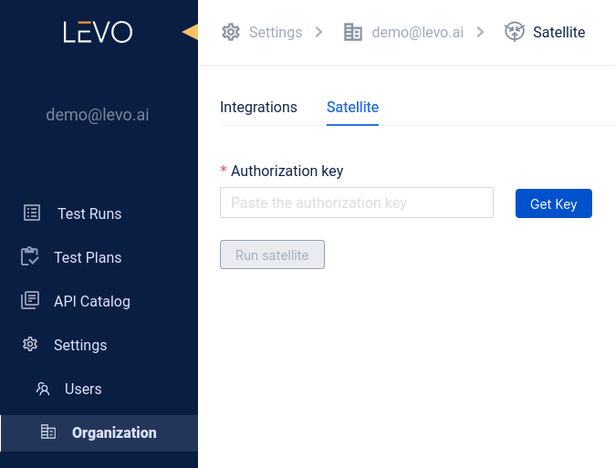
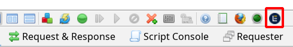
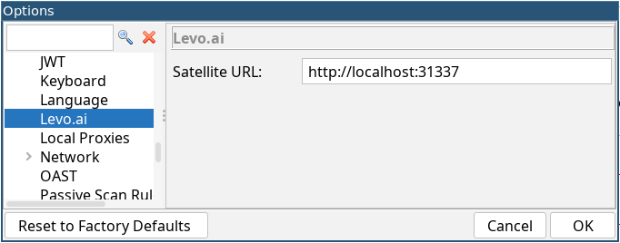

# Quickstart with OWASP ZAP

The Levo.ai add-on for ZAP allows building OpenAPI specs with the traffic sent or proxied via ZAP.

This guide assumes that you have [signed up for a Levo account](https://app.levo.ai/signup) and have [installed a recent version of ZAP](https://www.zaproxy.org/download/) (> 2.12.0).

Here are the steps you need to follow to start building OpenAPI specs with Levo and ZAP:
1. The OpenAPI spec is built by sending anonymized API traces to Levo. You may run the *Satellite* (a set of services which receives and processes the traces) locally using docker or minikube, on AWS with an AMI provided by Levo, or use a temporary 40-minute instance spun-up by Levo using Google Cloud Run.
   1. If you want to run the satellite yourself, follow the instructions on this page as per your prefered mode of installation.
    Note that the collector does not need to be enabled.
    ZAP should be able to reach the satellite at port `9999`.
    If the satellite is running inside a container, you may need to forward a port from the host to port `9999` inside the container.
   2. The easier option is to use a temporary satellite instance provided by Levo.
    Go to Organizations &rarr; Satellite in the Levo dashboard, generate and enter an authorization key, and start the satellite. Copy the provided Cloud Run URL.

    
2. Launch ZAP and install the Levo.ai add-on from the [ZAP Marketplace](https://www.zaproxy.org/addons/). You may need to restart ZAP after the add-on is installed.
3. If the add-on is successfully installed, you should see a new button in the main toolbar.
   

   Clicking on it will toggle sending traffic to Levo's satellite.
4. Navigate to Tools &rarr; Options &rarr; Levo.ai in ZAP and enter the URL pointing to the satellite (e.g. `http://localhost:9999`).

   
5. Ensure that the Levo button is enabled in the toolbar, and you are good to go! Start browsing your website using ZAP and you should start seeing auto-discovered applications in your Levo dashboard in a few minutes.

