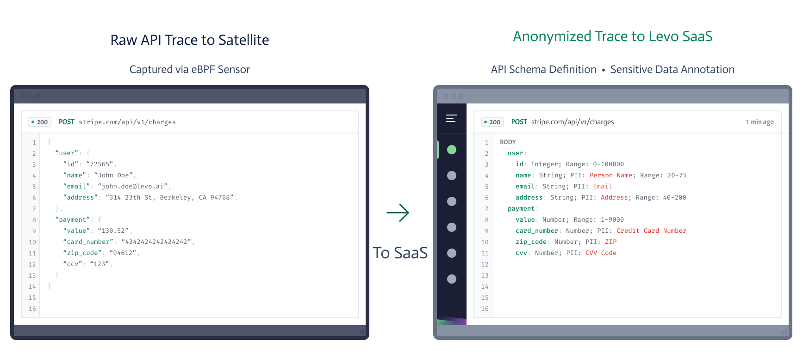

# Key Concepts

API Observability involves three components - a) Sensor, b) Satellite, and c) API Catalog.

## Sensor
The sensor is a userspace process, that uses [Extended Berkeley Packet Filters (eBPF)](https://ebpf.io) to passively capture API traffic (full HTTP payloads) from Linux workloads. The sensor works on bare metal, virtual machine, and container formats.

eBPF is used by all the modern observability & security vendors, including [DATADOG](https://www.datadoghq.com/product/network-monitoring/network-performance-monitoring/), [new relic](https://newrelic.com/platform/kubernetes-pixie), [paloalto networks](https://www.paloaltonetworks.com/prisma/cloud), [aqua](https://www.aquasec.com/products/tracee/), [sysdig](https://sysdig.com/), [Cilium](https://cilium.io/), etc.

Similar to [network traffic mirroring](https://docs.aws.amazon.com/vpc/latest/mirroring/what-is-traffic-mirroring.html) the sensor works at the Linux host level.

The sensor does not require any modifications to your application workloads. Absolutely no SDKs, no code changes, no configuration changes, no sidecars, and no runtime agents.

The sensor is not *inline* with the application workloads and ***will not*** impact the workload. API traffic can be aggressively sampled in high traffic environments, to limit CPU consumption by the sensor. 

The sensor can be run in both production and pre-production environments. Captured API Traces (HTTP traffic) is sent to the Satellite component, for data anonymization, schema generation, and sensitive data detection/annotation.

## Satellite
The Satellite runs within the customer premises or VPC, and can be run alongside application workloads, or in a separate host.

It uses sampled API traffic (API Traces) from the Sensor to:
    
1. Auto discover API endpoints
2. Derive (OpenAPI) schema for the discovered API endpoints
3. Detect sensitive data (PII, PSI, etc.) present in API data
4. Annotate the derived schema with sensitive data types
5. Send the API schema to Levo SaaS for API Catalog building

### Your Data Stays with You!

Privacy preserving technology ensures your API data stays with you.

Typical API observability solutions, will ingest all your API data into their SaaS, and put the burden of redacting sensitive customer data on you.

Levo’s privacy preserving technology, does not ingest any of your API data into SaaS. Levo discovers and documents your APIs using only data type inferences performed in the Satellite.

## API Catalog
Levo SaaS aggregates data received from the Satellite to create an [API Catalog](../../concepts/api-catalog/api-catalog.md).

The API Catalog is the source of truth to answer the following questions:

- What APIs do I have in my environment?
- Which APIs are exposed externally?
- What is the schema for my APIs?
- Which APIs process sensitive data (PII, PSI, etc.)?
- Which users, via which roles/scopes are accessing, which API endpoints?
- Are my API schema's drifting?

The API Catalog also serves as the primary input for Levo's API [security](https://docs.levo.ai/test-your-app/test-app-security/choices) & [contract](https://docs.levo.ai/test-your-app/test-app-schema-conformance) testing features.
