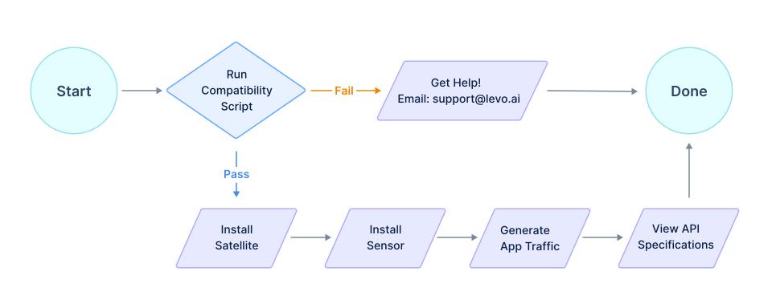

# Install Guide

This guide provides *comprehensive instructions* for installing the Satellite, and Sensor on a supported platform of your choice (Kubernetes, Docker, or Linux Virtual Machine).

Platform specific instructions are described in the steps below.

Your estimated completion time is *10 minutes*.

### 1. [Signup](https://levo.ai/levo-signup/) for a forever free account on Levo.ai

### 2. [OS Platform Compatibility Check](./os-compat-check.mdx)

### 3. [Install Satellite](./install-satellite.mdx)

### 4. [Install Sensor](./install-sensor.md)

### 5. [Generate Traffic for Your Application](./generate-traffic.md)

### 6. [View Auto-discovered OpenAPI Specifications](./view-api-catalog.md)

