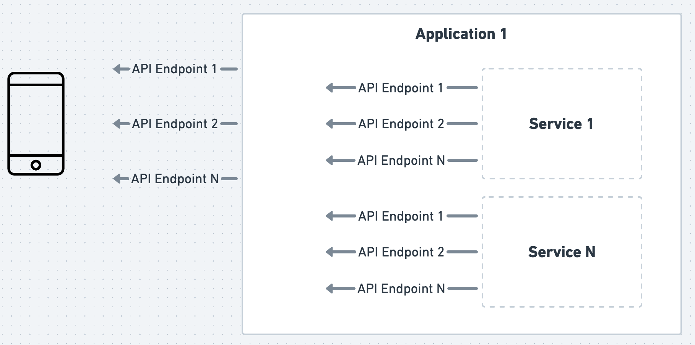
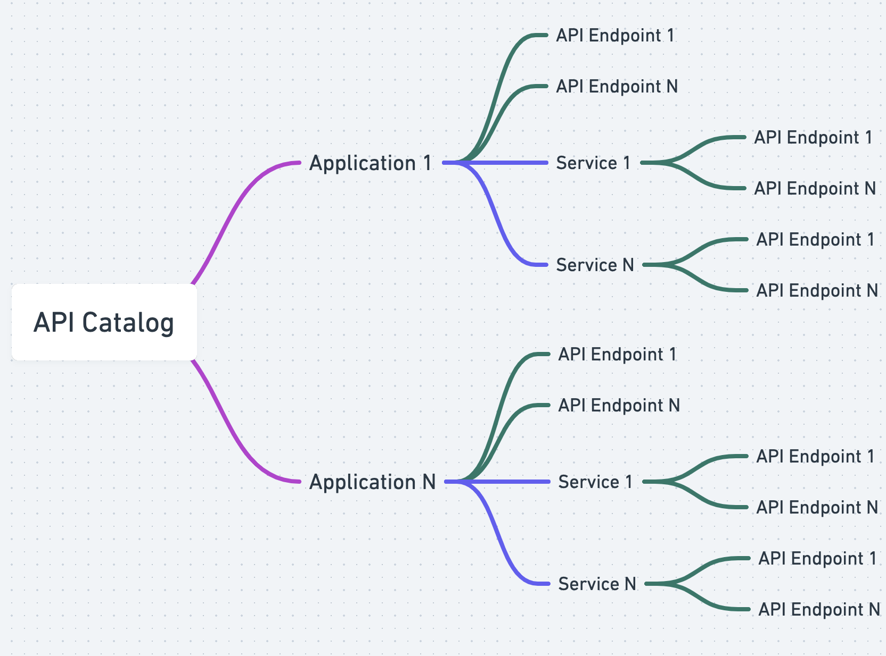

# API Catalog
Levo autogenerates security and resilience tests for APIs based on schema definitions for API endpoints.

These schemas can either be auto discovered (by observing runtime traffic) or imported into Levo.

The API Catalog is a store and directory for the aforementioned schemas. 

The catalog is comprised of `Applications`, and `Services`. An `Application` is a logical grouping of a set of API endpoints.

An `Application` can contain one or more `Services`, where a `Service` is another logical grouping of a set of API endpoints.

This type of organization is very common in [Microservices Architecture (MSA)][msa].

[msa]: https://aws.amazon.com/microservices/

