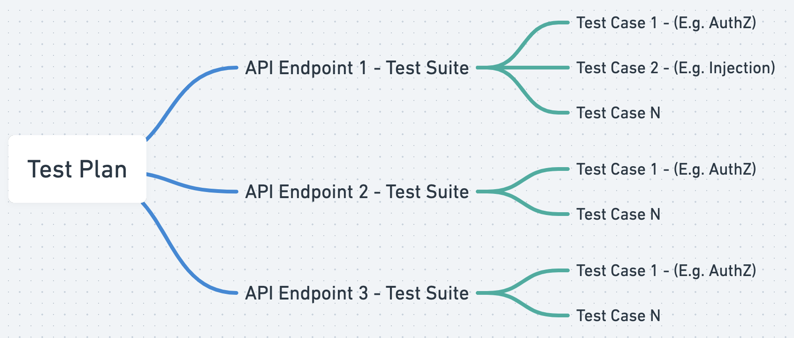

# Test Plans
Autogenerated `Test Plans` are tailor-made for each API (and it's associated endpoints).

Test Plans can be generated for APIs present in either the `Application` or `Service` (API Catalog) groupings.

A Test Plan is structured as show below.

A Test plan is comprised of `Test Suites`. A Test Suite is focussed on a single API endpoint, and comprises of a set of `Test Cases`.

A `Test Case` has a singular objective, and tests the specific API endpoint for a specific vulnerability. For example, test the API endpoint for a [SSRF][SSRF-lnk] vulnerability, or an authorization bypass vulnerability.

[SSRF-lnk]: /vulnerabilities/v1/OWASP-WEB-10/A10-SSRF