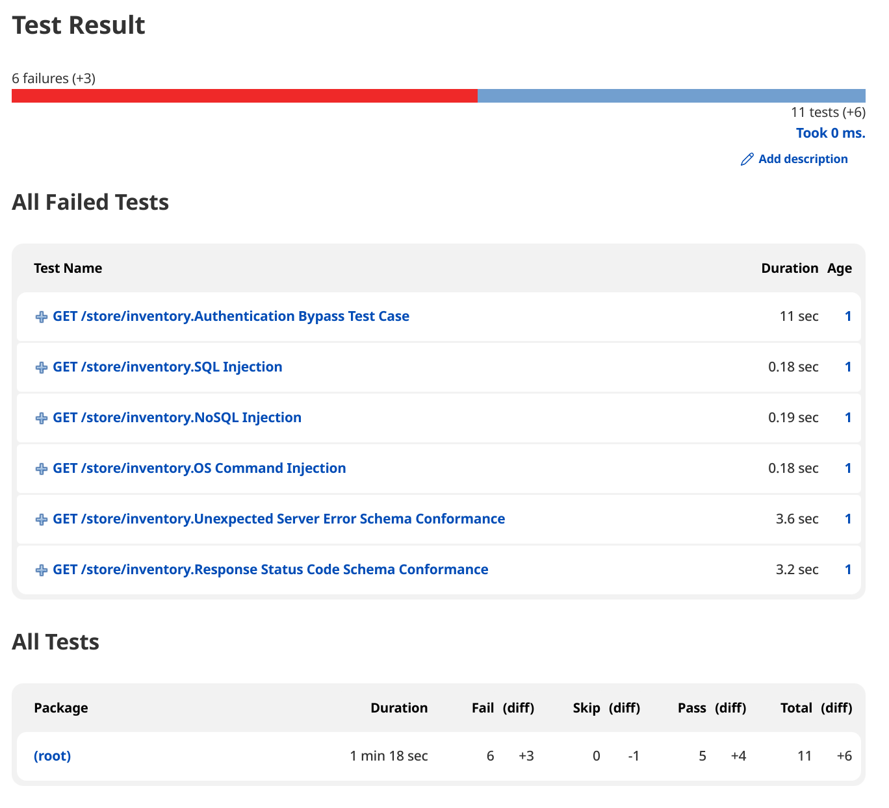
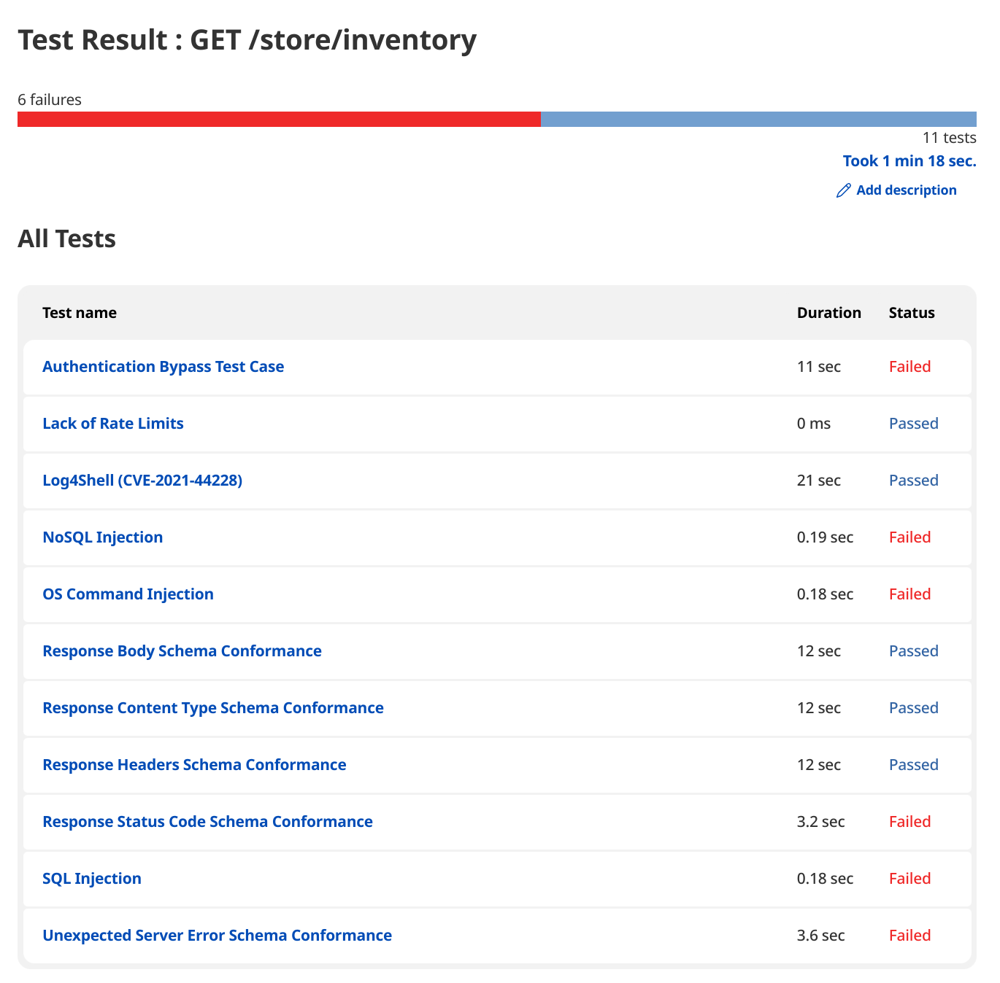
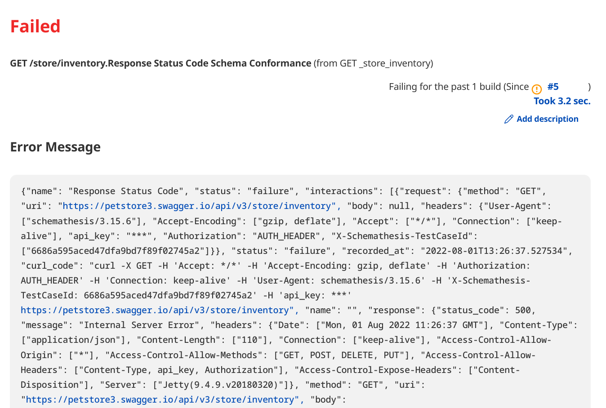

# JUnit Format Test Results

[JUnit XML format](https://www.ibm.com/docs/en/developer-for-zos/14.1.0?topic=formats-junit-xml-format) is a really popular industry format that is used for test result reporting.

Levo CLI can produce JUnit/XUnit format output for all test results (security/schema conformance). Please refer to the [CLI Command Reference](../../security-testing/levo-cli/levo-cli-command-reference.md) for more details on command line switches (`--export-junit-xml`) that activate this output.

There are many tools in the industry that consume this format, and produce HTML, and PDF reports of test results. A few examples are [Jenkins JUnit Plugin](https://plugins.jenkins.io/junit/), [Jenkins XUnit Plugin](https://plugins.jenkins.io/xunit/), [junit2html](https://gitlab.com/inorton/junit2html), [Ant JUnitReport](https://ant.apache.org/manual/Tasks/junitreport.html), [xunit-viewer](https://github.com/lukejpreston/xunit-viewer), etc.

Below are some examples of JUnit format test results rendered in Jenkins via the [JUnit plugin](https://plugins.jenkins.io/junit/).

