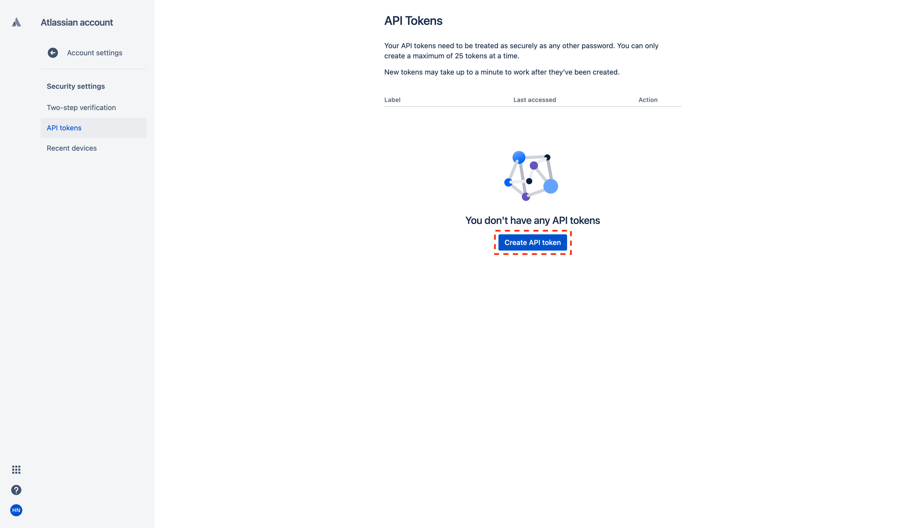
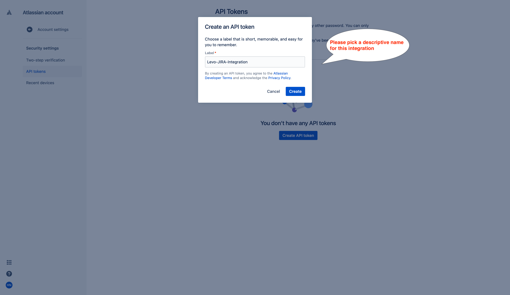
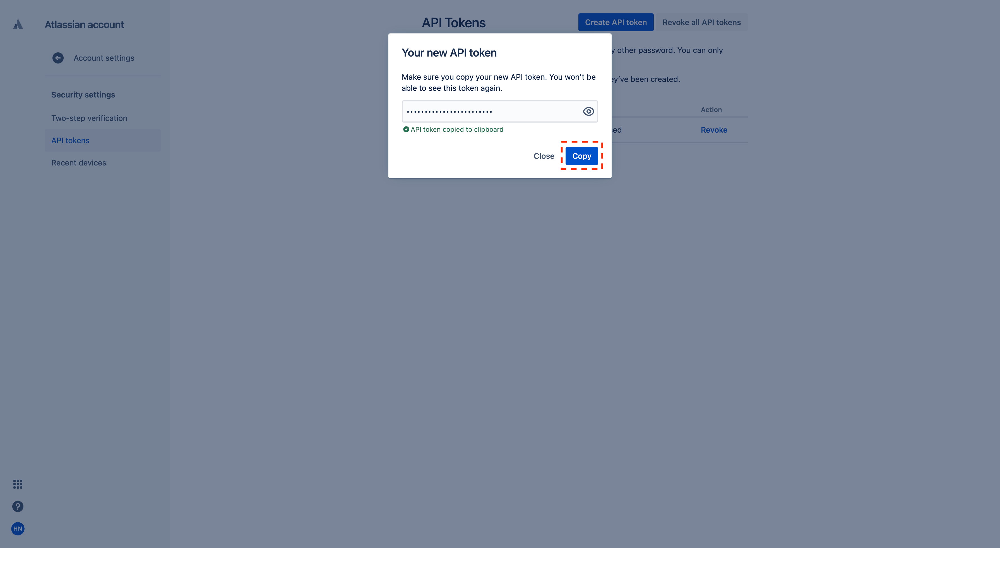
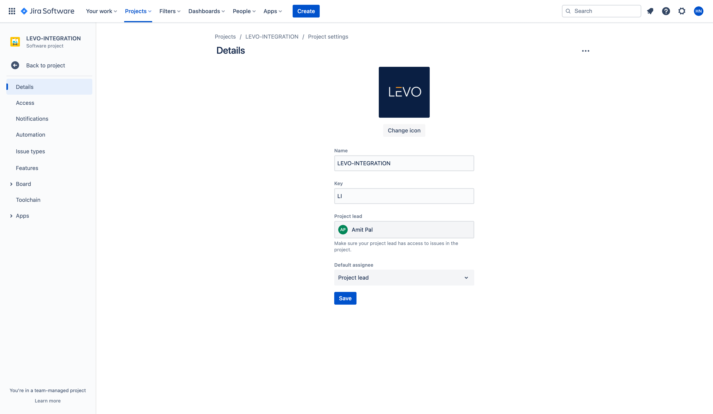
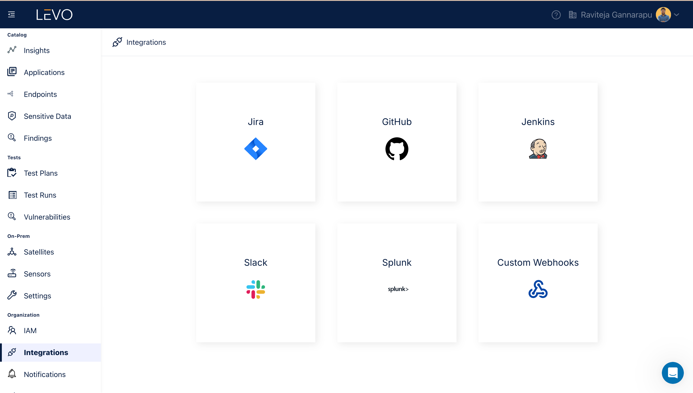
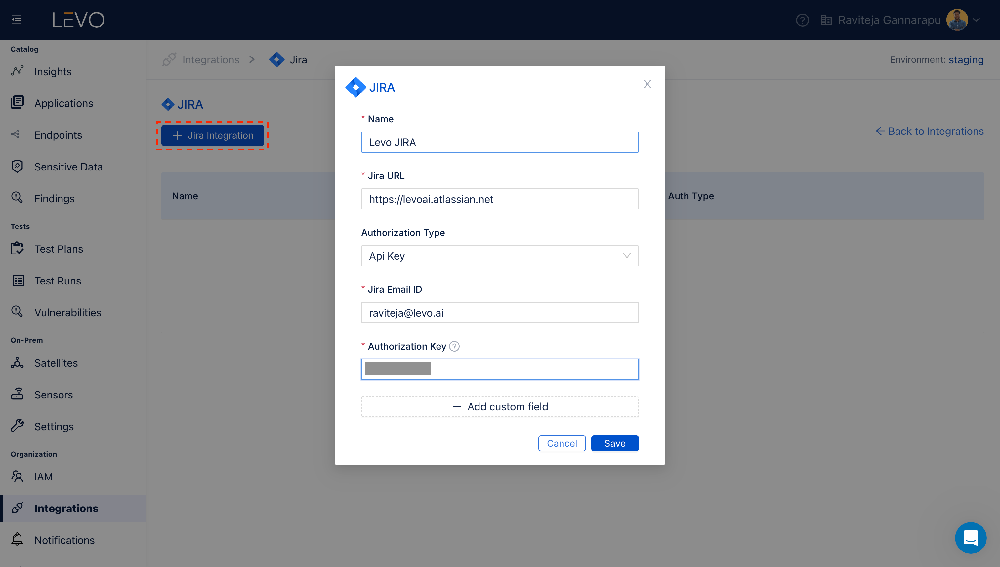
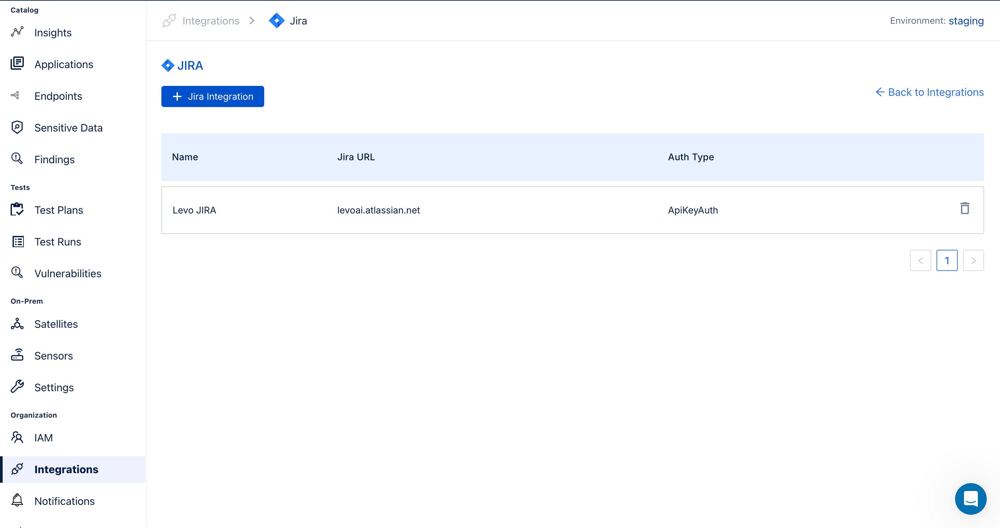
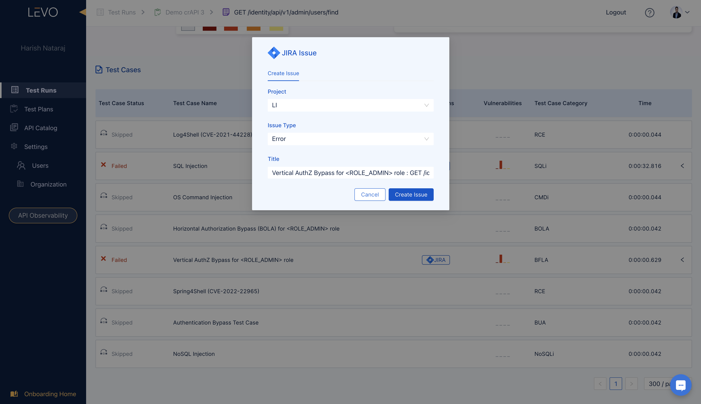

# Ticketing / Notifications

- [Atlassian JIRA Integration](#atlassian-jira-integration)

- [Generic Webhook Based Integrations](#generic-webhook-based-integrations)

  

-----------------

## Atlassian JIRA Integration

This integration allows JIRA tickets to be created/viewed directly from Test Run failures reported by Levo. Below are links to common tasks.

- [Add JIRA Integration](#add-jira-integration)
- [Creating JIRA Tickets From Test Run Failures](#creating-jira-tickets-from-test-run-failures)
- [Viewing Linked JIRA Tickets From Test Run Failures](#viewing-linked-jira-tickets-from-test-run-failures)

### Add JIRA Integration

1. Prerequisites
   - Ensure you have a JIRA account, and note down the URL for the JIRA service.
   - Create an API integration token in your Atlassian account as shown below.
   
   
   
   - Copy the API Token
   
   - Identify the JIRA `Project` that will be the recipient  for the tickets created from Levo, and note down the project's `Key` name.
   

2. Enable JIRA Integration 
   - In the Levo SaaS console, navigate to the Integrations screen as shown below
   
   - Configure the JIRA integration following the steps below. Specify the `Project Key` rather than the `Project Name` in the screens below. 
   
   - Save the settings to enable the integration
   

   Congratulations! You have successfully enabled the JIRA integration. Below are steps to a) create JIRA tickets from failed test runs, and b) view linked JIRA tickets from failed test cases.

### Creating JIRA Tickets From Test Run Failures
Follow the below steps to create a JIRA ticket for a specific Test Case failure (security vulnerability) reported in a Test Run.

- Navigate to the Test Run where the Test Case failure of interest is present.
- Navigate to the specific Test Case that has failed, and click on the JIRA icon

- Complete the dialog appropriately to create a JIRA ticket

- Optionally verify if the ticket was successfully created in JIRA.

### Viewing Linked JIRA Tickets From Test Run Failures
Test Case failures that are linked with a JIRA ticket, will have a check mark icon as shown below. Clicking on the icon will open the JIRA ticket in a new browser tab.

-----------------

## Generic Webhook Based Integrations
Levo can integrate with many other ticketing,  notification, and SIEM systems via generic webhooks. Please contact `support@levo.ai` for more info.
