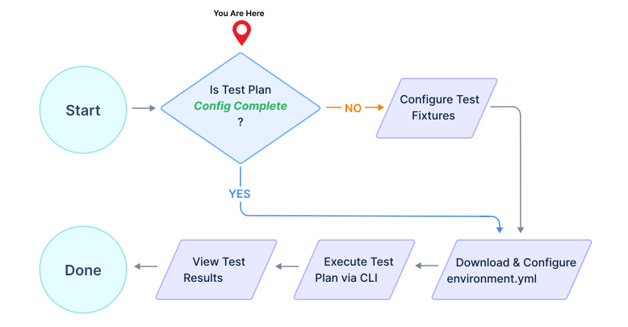

# How do I run a Data Driven Test Plan?

Below are the high level steps for running a previously generated Data Driven Test Plan.

### 1. Check Test Plan State

- If your Test Plan is in the `Config Complete` state, goto step 3 below.

- If your Test Plan is in the `Config in Progress` state, goto step 2 below.

- If your Test Plan is not in either of the above states, please contact Levo Support (support@levo.ai).

### 2. Configure Test Fixtures

Data Driven Test Plans may require some parameter data to be configured for the API endpoints, prior to execution.

Please follow detailed steps outlined [here](/guides/security-testing/test-your-app/test-app-security/data-driven/configure-plan-fixtures.md), to configure parameters via `Test Fixtures`.

Your test plan's `Runnable` status, and `number of test cases runnable` will auto update as you configure required parameters.

The Test Plan will be `Runnable` if at least one Test Case is runnable.

You can always continue to step 3, even if you have not completed configuring parameters for all Test Suites, and Test Cases. This is OK as long as the Test Plan is in the `Runnable` state.

Test Cases that are not runnable, will be skipped during execution of the Test Plan.

### 3. Download & Configure `environment.yml`
    
Your test plan `may` have an auto generated `environment.yml` associated with it.
    
If it was auto generated follow the steps outlined [here](/guides/security-testing/test-your-app/test-app-security/data-driven/configure-env-yml.md), to download and configure it appropriately.

### 2. Execute Test Plan via CLI

Follow instructions [here](/guides/security-testing/test-your-app/test-app-security/data-driven/execute-test-plan.md) to execute the Test Plan via the CLI (Test Runner).

### 3. View Test Results

In the Levo SaaS console side panel, click on `Test Runs` and navigate to your most recent test run results.