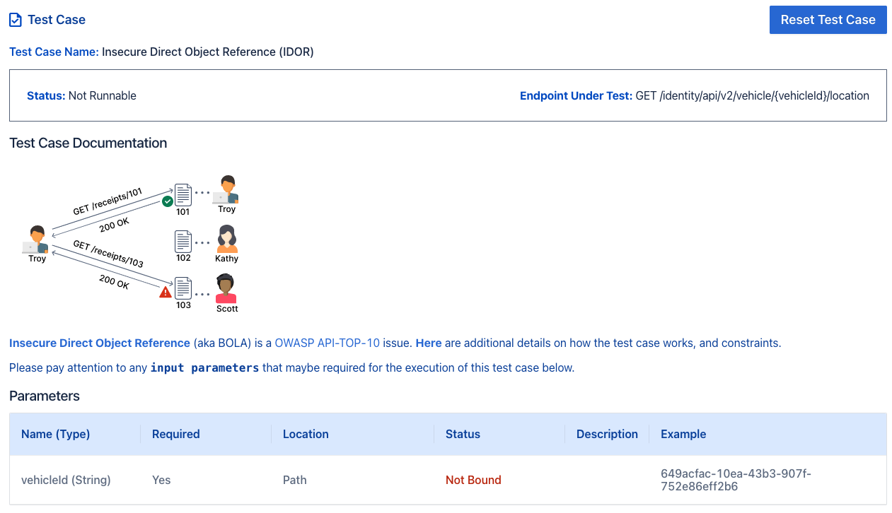

# Configuring Test Fixtures

## Test Case Level Fixtures


Above is an example of a test case for the endpoint `GET /identity/api/v2/vehicle/{vehicleId}/location`.

This endpoint requires a valid value for path parameter `{vehicleId}` for successful invocation. This requirement
is shown in the *`Parameters`* table in the test case. `Not Bound` indicates that a valid value is required to execute
this test case.

Levo autogenerates fixtures for these required API parameters. These autogenerated fixtures are located in the `parameters.py` code block of the test case (see below).


Here is a zoom in view of the autogenerated (commented-out) fixture for `vehicleId`:
```python
#@levo.fixture(name="vehicleId", location="path")
#def vehicleid():
#    return "Enter Your Value Here."
#
```

### Steps to Configure Fixture

1. Block select the fixture code in the editor, and use `CMD + /` to uncomment the fixture code.

```python
@levo.fixture(name="vehicleId", location="path")
def vehicleid():
    return "Enter Your Value Here."

```

2. Now enter a value for the `vehicleId` that is valid for your live API endpoint that you want to test.

```python
@levo.fixture(name="vehicleId", location="path")
def vehicleid():
    return "649acfac-10ea-43b3-907f-752e86eff2b6"
```

In the above example `649acfac-10ea-43b3-907f-752e86eff2b6` is the value that will be used for `vehicleId`,
when executing this test case against a live API target.

3. Remember to save the changes you made.

#### You are done!