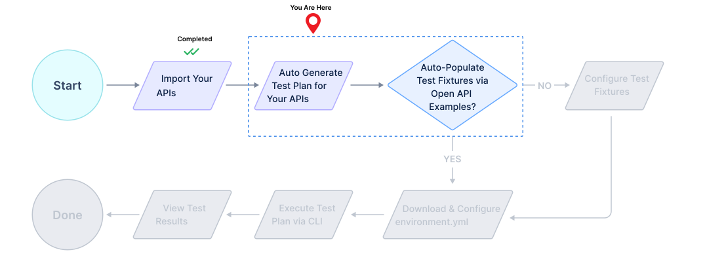

# Auto Generate Test Plan

## 1. Generate a security test plan for your APIs

1. Click on `Test Plans` in the side panel and proceed to create a test plan by clicking `New Test Plan`.

2. Pick `Data Driven` as the type of test plan to generate.

3. In the `New Test Plan` dialog pick a suitable name for the plan. 

4. Pick the previously imported API catalog as the API asset for this test plan.

5. If your API specification has [example values][example-values], and these example values will work with your live API endpoints, then check the check box named **`Auto-populate API parameters for this test plan`**.

    > This uses examples in the OpenAPI specification file to auto populate [test fixtures/API parameters][fixtures] that are required in the generated test plan.
    The example values are used in making API requests during test execution.

6. Proceed to generate the test plan. The generated test plan will have coverage for several security vulnerabilities.

7. Depending on if you used `Auto-populate API parameters for this test plan`, in the previous step, and how comprehensive the provided examples are, your newly generated test plan with either be in the `Config Complete` or `Config in Progress` states.

8. If your test plan is in the `Config Complete` state, it is immediately runnable, and you can proceed to [**Configure environment.yml**][download-env-step].

9. If your test plan is in the `Config in Progress` state, you will need to configure values for API parameters using [test fixtures][fixtures].
The next section describes the processing of configuring API parameter values via fixtures.

[example-values]: https://swagger.io/docs/specification/adding-examples/
[fixtures]: /guides/security-testing/concepts/test-plans/fixtures/test-fixtures.md
[download-env-step]: configure-env-yml.md
