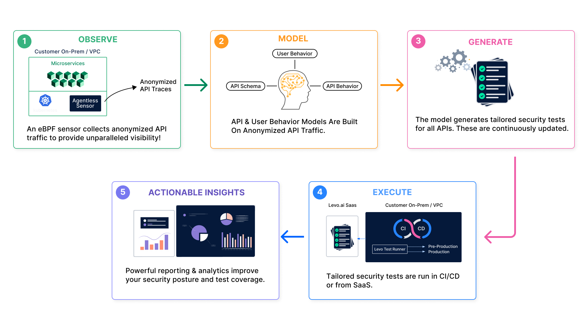

# How does Levo work?

## Observe
`You cannot protect what you cannot see!` Visibility of APIs is fundamental for API Management, Governance, and Security.

Levo provides frictionless API Observability via a no-code and agentless approach. Conventional instrumentation techniques are very intrusive, and require DevOPs teams to add runtime agents, SDKs, or sidecar proxies to their running applications/services. This causes unnecessary friction between DevOPs and SecOps teams.

Levo uses an [eBPF](https://ebpf.io/) sensor to passively, and transparently capture all API traffic in pre-production and production environments. The eBPF sensor is *not* inline with application traffic, and will not impact the performance of the applications being instrumented.

Further, unlike API anomaly detection solutions that cannot sample API traffic, Levo can sample traffic aggressively, leading to optimized resource consumption by the eBPF sensor.

The captured API traffic is anonymized (only API metadata/schema is extracted), and then sent to Levo SaaS. Levo SaaS only consumes API schema, and does not ingest any of your actual API data.

The `observe` phase is optional, if you already have OpenAPI specifications for your APIs. Levo can simply import your OpenAPI and Swagger files.

## Model
API metadata consumed from your runtime environments is used to build a behavior model of your APIs.

The Model comprises of a comprehensive API catalog. The API Catalog is the auto discovered, and auto documented [OpenAPI Specification](https://swagger.io/specification/) of all the API endpoints present in your runtime environments.

The API Catalog provides continuous visibility to enable proper API Management & Governance.

## Generate
The model generates tailored security test plans for all your auto discovered API endpoints. The test plans are analogous to [Postman Collections](https://www.postman.com/collection/).

The test plans provide comprehensive coverage for business logic, authentication/authorization, and OWASP Top 10 vulnerabilities that are specific to APIs.

## Execute
The test plans execute in CI/CD [gates](https://docs.microsoft.com/en-us/azure/devops/pipelines/release/approvals/gates?view=azure-devops) via Levo's `Test Runner`, similar to how DevOPs teams run functional tests (unit, integration, etc.).

Levo provides Test Runner plugins for popular CI/CD vendors. The Test Runner is packaged as a Docker image.

Results from the test plan execution are emitted to both CI/CD logs and Levo SaaS.

## Actionable Insights
Levo provides high fidelity, low noise, and jargon free (vulnerability) findings that are targeted for direct consumption by development teams.

Findings have detailed API traffic logs that aid in better comprehension, and problem reproduction.

Levo provides contextual remediation help for development teams to address issues via self service.
