# Jira

## Atlassian JIRA Integration

This integration allows JIRA tickets to be created/viewed directly from Test Run failures reported by Levo. Below are links to common tasks.

- [Add JIRA Integration](#add-jira-integration)
- [Creating JIRA Tickets From Test Run Failures](#creating-jira-tickets-from-test-run-failures)
- [Viewing Linked JIRA Tickets From Test Run Failures](#viewing-linked-jira-tickets-from-test-run-failures)

### Add JIRA Integration

1. Prerequisites
    - Ensure you have a JIRA account, and note down the URL for the JIRA service.
    - Create an API integration token in your Atlassian account as shown below.
      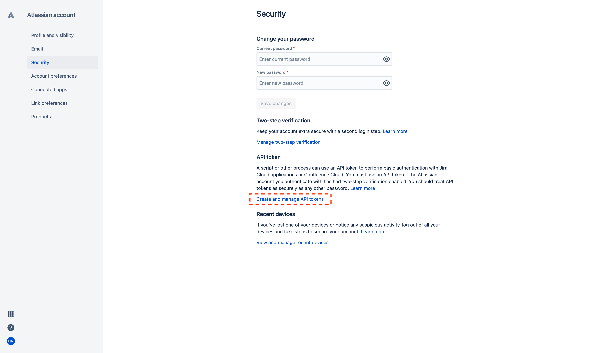
      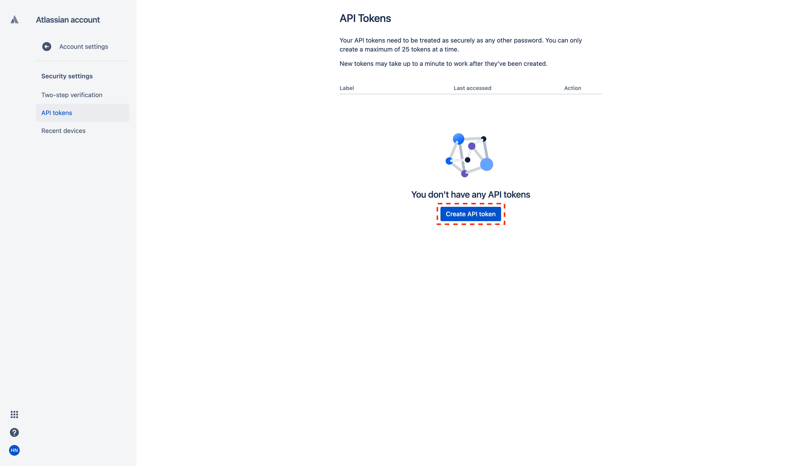
      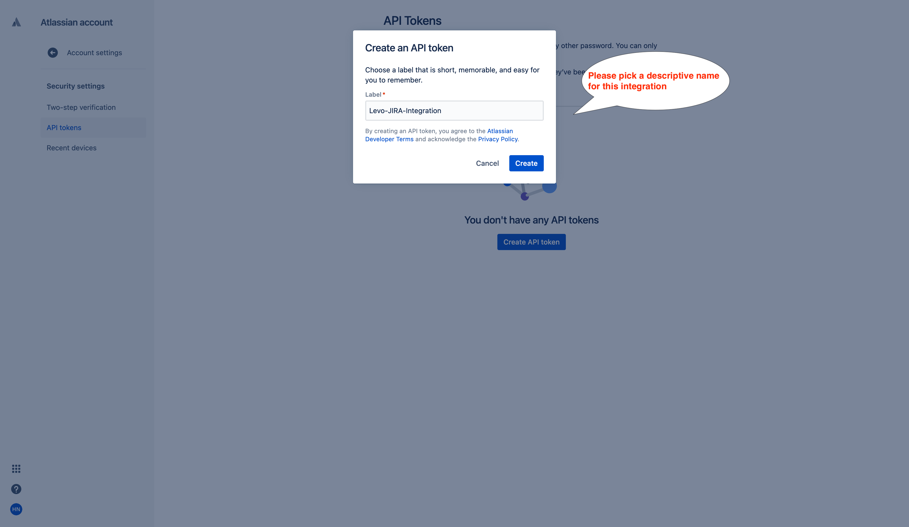
    - Copy the API Token
      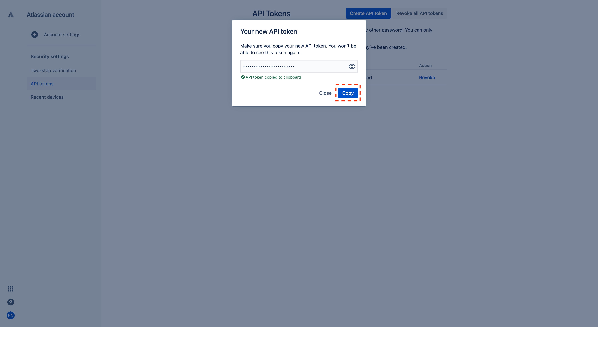
    - Identify the JIRA `Project` that will be the recipient  for the tickets created from Levo, and note down the project's `Key` name.
      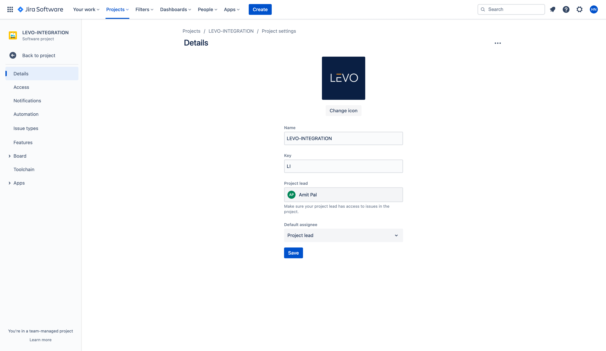

2. Enable JIRA Integration
    - In the Levo SaaS console, navigate to the Integrations screen as shown below and click on `Jira` tile.
      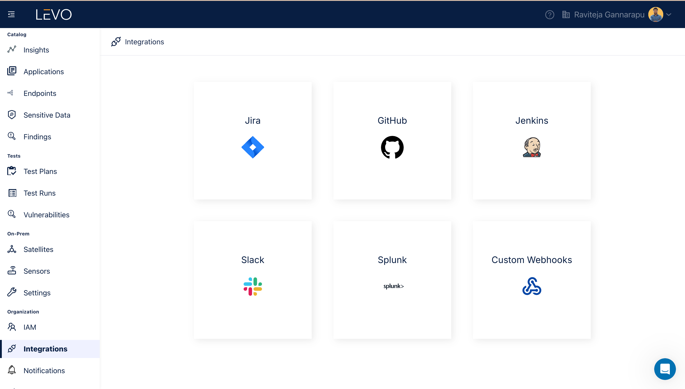
    - Configure the JIRA integration following the steps below. Specify the `Project Key` rather than the `Project Name` in the screens below.
      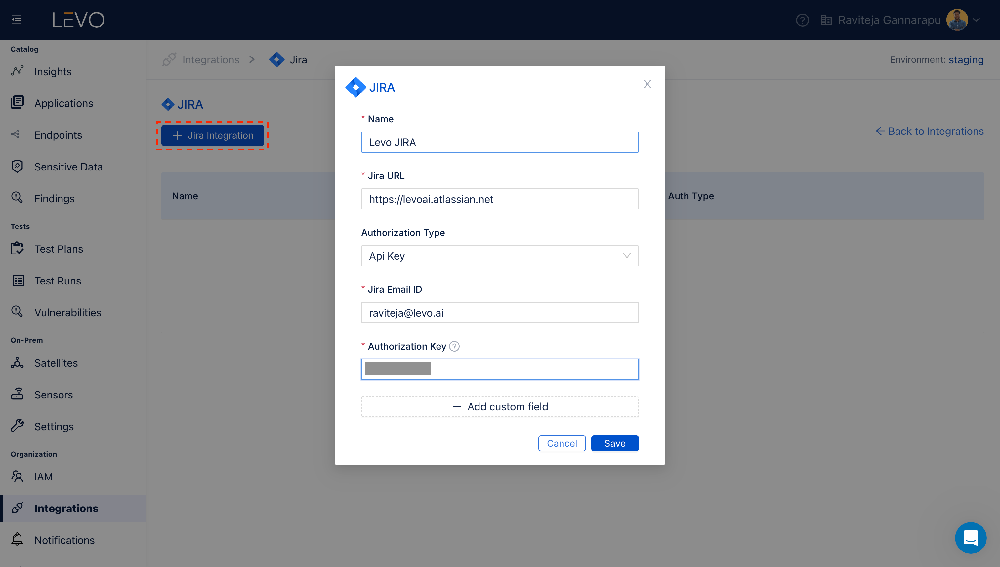
    - Save the settings to enable the integration
      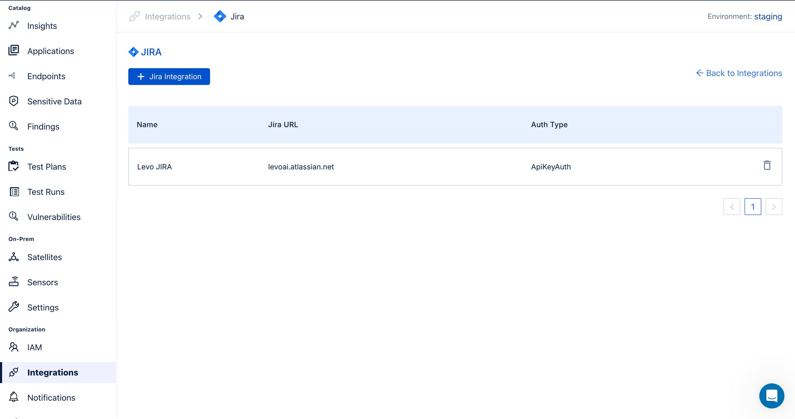

   Congratulations! You have successfully enabled the JIRA integration. Below are steps to a) create JIRA tickets from failed test runs, and b) view linked JIRA tickets from failed test cases.

### Creating JIRA Tickets From Vulnerability Page
Follow the below steps to create a JIRA ticket for a specific Vulnerability reported from a Test Run.

- Navigate to the Vulnerabilities page.
  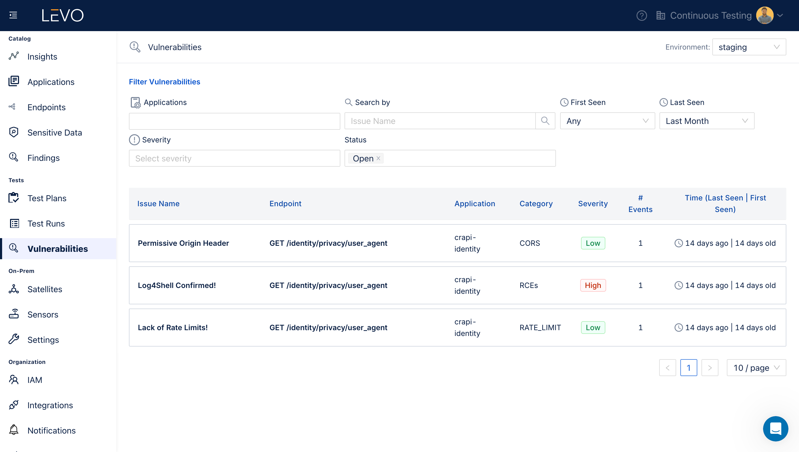
- Navigate to the specific Vulnerability, and click on the `Create Ticket` icon.
  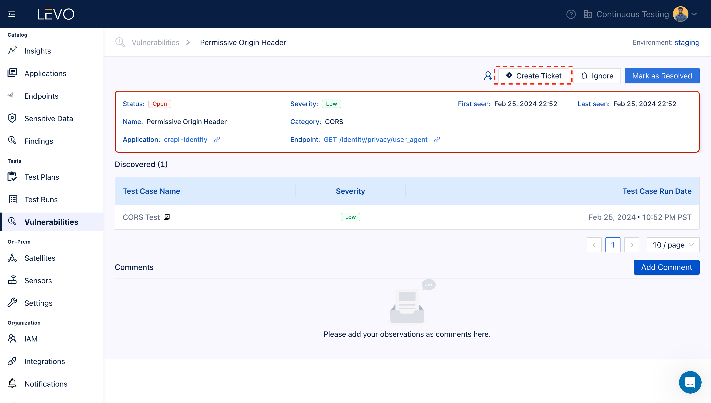
- Complete the dialog appropriately to create a JIRA ticket
  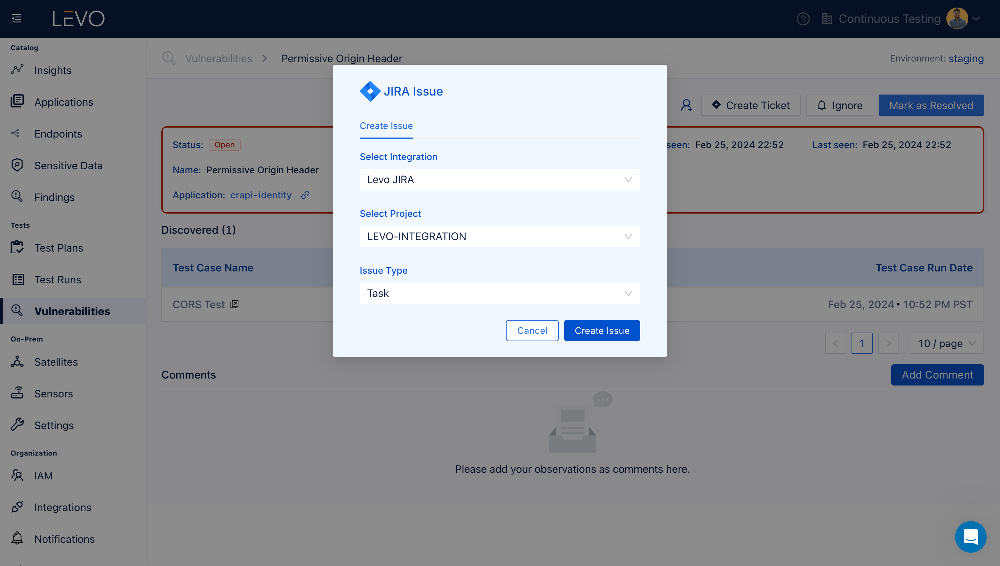
- Optionally verify if the ticket was successfully created in JIRA. Clik on `Jira Ticket` link to open the ticket in a new browser tab.
  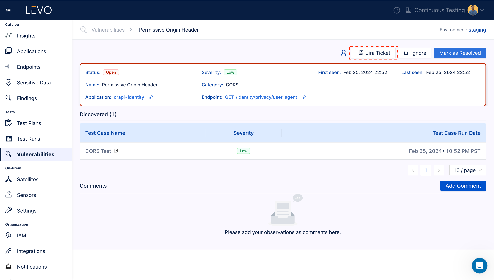

### Assign / Unassign JIRA Tickets From Vulnerability Page
Vulnerabilities that are linked with a JIRA ticket, will have a User Icon as shown below. Clicking on the icon will open the dialog, select user to assign/unassign user to a ticket.

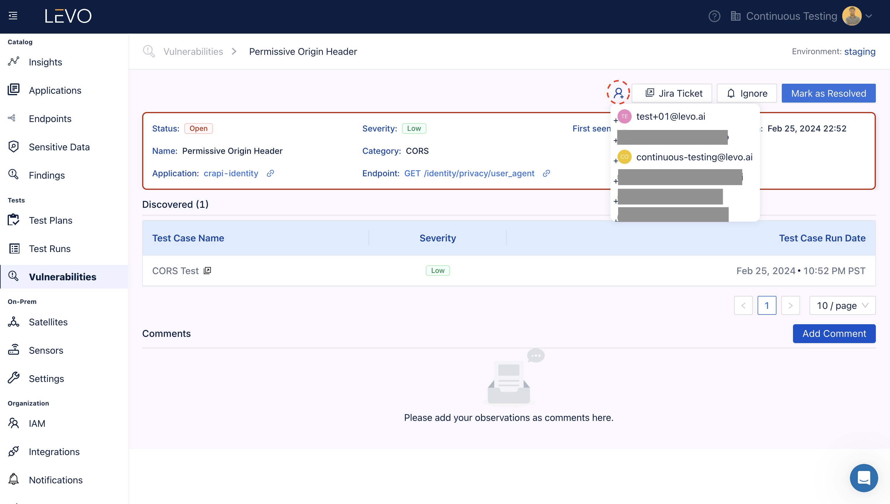

