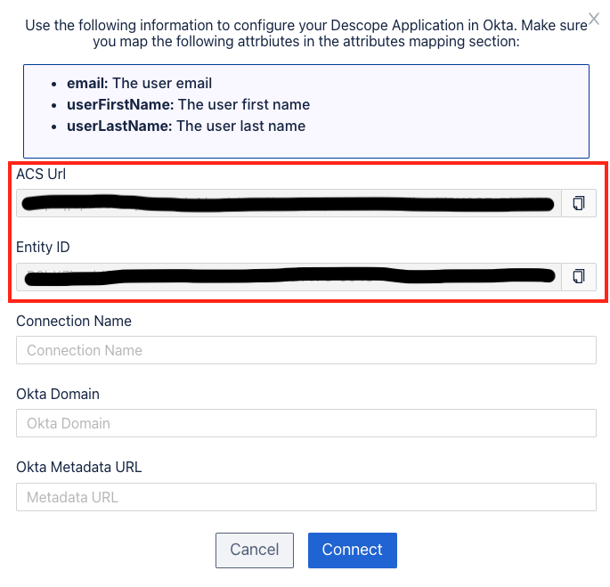
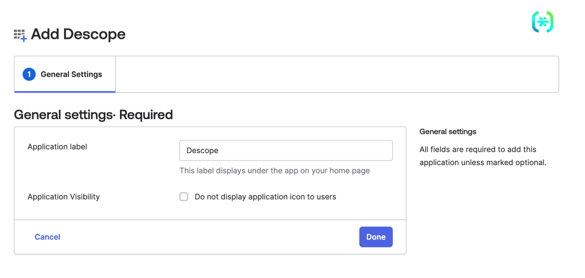
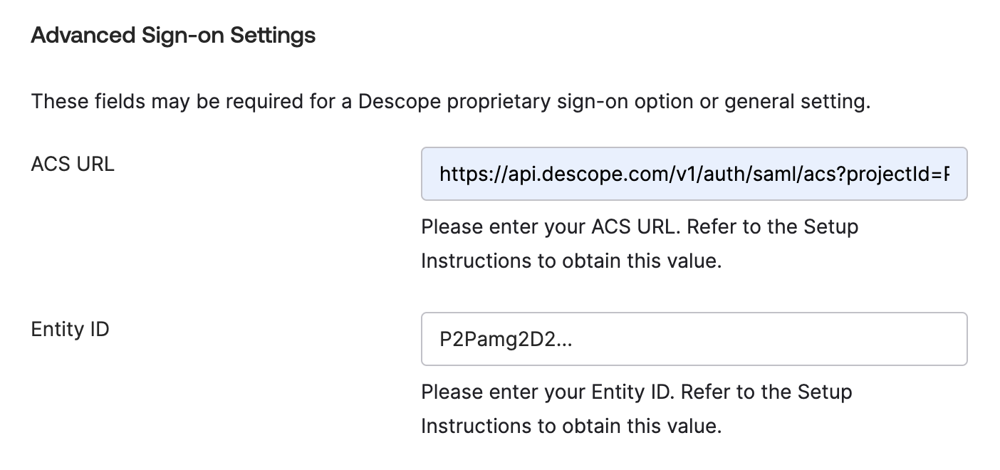
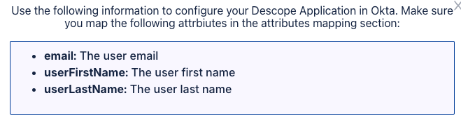

# Okta

## Configure Okta Integration using SAML

Follow these steps to successful configure the Okta Integration for your Levo organization. This will allow you to use Okta to login to the platform.

1. Navigate to Levo console IAM settings section and click on "Configure Okta" button.
2. Copy **ACS Url** and **Entity ID** to be used during the Okta app creation.

3. Navigate to the application creation screen in your Okta admin console.
4. Add the Descope app from the Okta Integration Marketplace.
5. When you first add the integration, assign a name for the custom app you're building and click Done:

6. Under Sign On > Advanced Sign-on Settings use the values we got in step 2:

7. Once you've added the app, expand the attributes field in the SAML section and add the following mapping:

8. Under Assignments in the same section, add the relevant User and Group assignments to your new application.
9. Go to Sign on methods > SAML 2.0 > Metadata details, to locate and copy your Okta Metadata URL.
10. And as a last step in the Okta app creation edit the logo of the application and replace it with the [Levo logo](../assets/Integrations/Okta/levo-logo.png) so you can identify it in your Okta dashboard.
11. Go back to Levo console and fill in the details to connect your Okta app.
    - **Connection Name**: AN identifier for the connection.
    - **Domain**: Email domain of your organization users.
    - **Okta Metadata Url**: The Metadata URL you copied from Okta.

After that, you should be able to use this custom app to login to Levo using Okta.