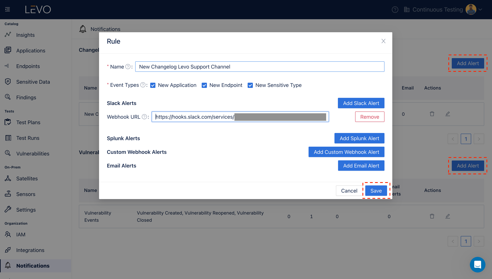
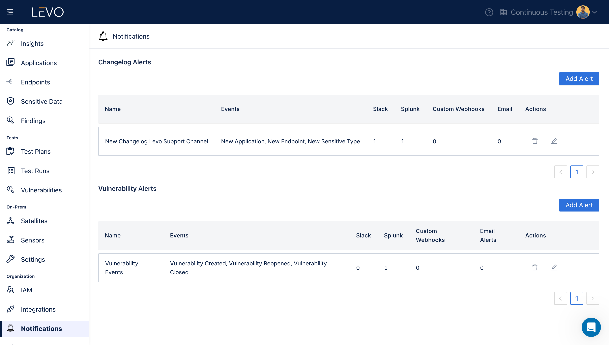

# Slack

### Add Slack Integration

1. Prerequisites
    - Sign in to your Slack and navigate to the channel where you want to receive notifications.
    - Click on the channel name, then select "Integrations" > "Add an app".
    - Search for "Incoming WebHooks" and install it.
    - Select the channel for posting messages and click "Add Incoming WebHooks integration".
    - Copy the Webhook URL provided.

2. Enable Slack Integration
    - In the Levo SaaS console, navigate to the Integrations screen as shown below and click on `Slack` tile.
      
    - Configure the Slack integration following the steps below.
      - Select the event types for Changelog Notifications and Vulnerability Notifications that you wish to receive.
        - Changelog Event Types: `New Application`, `New Endpoint`, `New Sensitive Type`.
        - Vulnerability Notification Types: `Vulnerability Created`, `Vulnerability Reopened`, `Vulnerability Closed`.
      - Paste the Webhook URL copied from Slack.
          
    - After configuring your preferences, save to activate the Slack integration.
      

