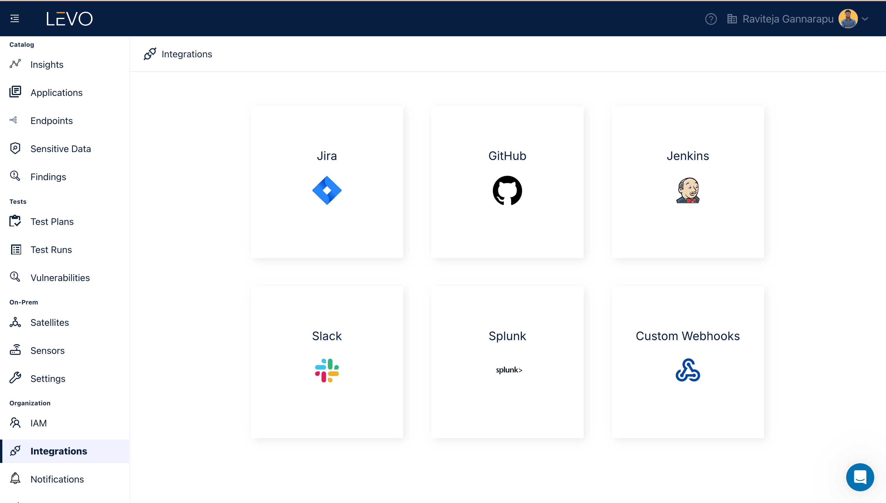

# Splunk

### Add Splunk Integration

1. Prerequisites
    - Sign in to your Splunk where you like to receive notifications.
    - Copy the `Webhook URL` and `HEC Token`.

2. Enable Splunk Integration
    - In the Levo SaaS console, navigate to the Integrations screen as shown below and click on `Splunk` tile.
      
    - Configure the Splunk integration following the steps below.
        - Select the event types for Changelog Notifications and Vulnerability Notifications that you wish to receive.
            - Changelog Event Types: `New Application`, `New Endpoint`, `New Sensitive Type`.
            - Vulnerability Notification Types: `Vulnerability Created`, `Vulnerability Reopened`, `Vulnerability Closed`.
        - Paste the Webhook URL and HEC Token copied from Splunk.
          
    - After configuring your preferences, save to activate the Splunk integration.
      

