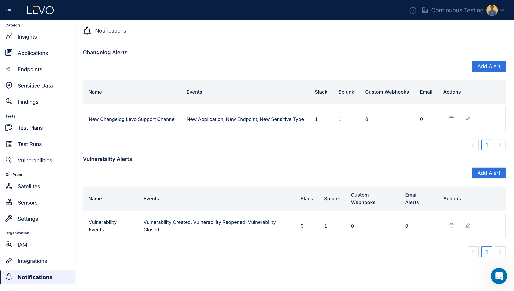

# Custom Webhooks

### Add Custom Webhook Integration

1. Prerequisites
    - Make sure you have the necessary webhook related information where you like to receive notifications.
    - Copy the `Webhook URL` and `API Key`.

2. Enable Splunk Integration
    - In the Levo SaaS console, navigate to the Integrations screen as shown below and click on `Webhooks` tile.
      
    - Configure the Webhooks integration following the steps below.
        - Select the event types for Changelog Notifications and Vulnerability Notifications that you wish to receive.
            - Changelog Event Types: `New Application`, `New Endpoint`, `New Sensitive Type`.
            - Vulnerability Notification Types: `Vulnerability Created`, `Vulnerability Reopened`, `Vulnerability Closed`.
        - Paste the Webhook URL and API Key copied earlier.
          
    - After configuring your preferences, save to activate the Webhook integration.
      
