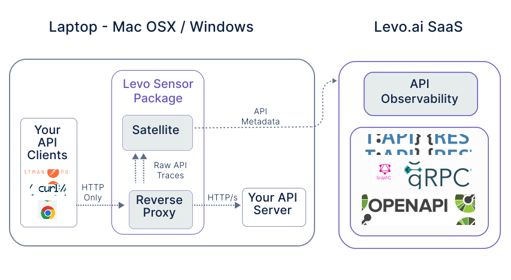

import Tabs from '@theme/Tabs';
import TabItem from '@theme/TabItem';

# Quickstart with MITM proxy

Quickstart instructions for evaluating *API Observability* on Laptops/Desktops running **Mac OSX** or **Windows**.



Since Mac OSX and Windows do not support [eBPF](https://ebpf.io), Levo provides a Sensor package (Docker based install), to enable quick evaluation on these platforms. This Sensor package gets visibility into your API traffic, by **[reverse proxying](https://www.cloudflare.com/learning/cdn/glossary/reverse-proxy/)** traffic between your *API Client* and *API Server*.

**Your estimated completion time is *10 minutes*.**

## 1. Prerequisites
<Tabs groupId="operating-systems">
  <TabItem value="mac" label="Mac OSX">
    <ul>
      <li> Docker Engine version `18.03.0` and above </li>
      <li> Admin (or `sudo`) privileges on the Docker host </li>
      <li> <a href="https://levo.ai/levo-signup/">Forever Free Account on Levo.ai</a> </li>
      <li> Command line terminal with Bash or Bash compatible shell </li>
    </ul>
  </TabItem>
  <TabItem value="win" label="Windows">
    <ul>
      <li> Docker Engine version `18.03.0` and above </li>
      <li> Admin privileges on the Docker host </li>
      <li> <a href="https://levo.ai/levo-signup/">Forever Free Account on Levo.ai</a> </li>
      <li> Docker containers MUST be allowed to connect to the internet. Please check Firewall settings </li>
      <li> PowerShell terminal </li>
    </ul>
  </TabItem>
</Tabs>


## 2. Setup Test *API Service*

API Observability auto discovers APIs and generates OpenAPI specifications for all API endpoints, by observing API traffic between your *API Client* and *API Server*.

If you do not have a test *API Service*/*Application*, you can use the [sample application](/guides/demo-application) provided by Levo.

- a. Note down the base URL for your test *API Server*/*Service*.
> For example, if you are running the sample application (crAPI) on your laptop, the base URL would be `http://localhost:8888`. If your local test *API Server* uses HTTPs the base URL for example, would be `https://localhost/`.

  > Since the Sensor package runs in a container, addresses like `localhost`, `127.0.0.1`, etc., that refer to the Docker host, must be translated to ones, that can be resolved correctly to point to the Docker host inside the container. Please specify `host.docker.internal` instead of `localhost` or `127.0.0.1` in the base URL.

  > In essence, if your base URL is `http://localhost:<port>` or `http://127.0.0.1:<port>`, you will need to specify `http://host.docker.internal:<port>` instead below.

- b. Export your *API Server*/*Service* URL in your terminal.
<Tabs groupId="operating-systems">
  <TabItem value="mac" label="Mac OSX">
    <pre>
      <code>
        export SERVICE_ADDRESS=&lt;http://host:port/base-path&gt;
      </code>
    </pre>
  </TabItem>
  <TabItem value="win" label="Windows">
    <pre>
      <code>
        $env:SERVICE_ADDRESS="&lt;http://host:port/base-path&gt;"
      </code>
    </pre>
  </TabItem>
</Tabs>


## 3. Copy `Authorization Key` from Levo.ai
The Sensor package uses an authorization key to access Levo.ai. Follow instructions below to copy & export the key.
- [Login](https://app.levo.ai/login) to Levo.ai.
- Click on your user profile.
- Click on `User Settings`
- Click on `Keys` on the left navigation panel
- Click on `Get Satellite Authorization Key`
- Now copy your authorization key.
- Export the copied `Authorization Key` in your terminal.

<Tabs groupId="operating-systems">
  <TabItem value="mac" label="Mac OSX">
    <pre>
      <code>
        export LEVOAI_AUTH_KEY=&lt;'Authorization Key' copied above&gt;
      </code>
    </pre>
  </TabItem>
  <TabItem value="win" label="Windows">
    <pre>
      <code>
        $env:LEVOAI_AUTH_KEY="&lt;'Authorization Key' copied above&gt;"
      </code>
    </pre>
  </TabItem>
</Tabs>


## 4. Pick an `Application Name`
Auto discovered API endpoints and their OpenAPI specifications are show in the [API Catalog](/guides/security-testing/concepts/api-catalog/api-catalog.md), grouped under an application name. The application name helps segregate and group API endpoints from different API servers, similar to how file folders work in an operating system.

- a. Pick a descriptive name which will be used in the subsequent step below. For example: `my-test-api-server`.
- b. Export the `Application Name` in your terminal.

<Tabs groupId="operating-systems">
  <TabItem value="mac" label="Mac OSX">
    <pre>
      <code>
        export LEVOAI_SERVICE_NAME=&lt;'Application Name' chosen above&gt;
      </code>
    </pre>
  </TabItem>
  <TabItem value="win" label="Windows">
    <pre>
      <code>
        $env:LEVOAI_SERVICE_NAME="&lt;'Application Name' chosen above&gt;"
      </code>
    </pre>
  </TabItem>
</Tabs>


## 5. Download - Docker Compose file

Execute the following in your terminal:

import BrowserOnly from '@docusaurus/BrowserOnly';

export function CurlScript(props) {
  var curlCmd = "curl";
  if (props.curlCmd) {
    curlCmd = props.curlCmd;
  }
  return (
    <BrowserOnly fallback={<div>Loading...</div>}>
      {() => (
        <pre>
          <code>
              {curlCmd} -s -o proxy-docker-compose.yml {window.location.protocol + '//' + window.location.host + '/artifacts/satellite/proxy-docker-compose.yml'}
          </code>
        </pre>
      )}
    </BrowserOnly>
  );
}

export function DownloadLink() {
  return (
    <BrowserOnly fallback={<div>Loading...</div>}>
      {() => (
        <a href={window.location.protocol + '//' + window.location.host + '/artifacts/satellite/proxy-docker-compose.yml'}> here </a>
      )}
    </BrowserOnly>
  );
}

<Tabs groupId="operating-systems">
  <TabItem value="mac" label="Mac OSX">
    <CurlScript/>
  </TabItem>
  <TabItem value="win" label="Windows">
    <CurlScript curlCmd="curl.exe"/>
  </TabItem>
</Tabs>

If prefer to download the Docker Compose file via your browser, you can download it <DownloadLink/>.


## 6. Install Sensor Package via Docker Compose
Execute the following in your terminal (where you previously downloaded the Docker Compose file):

<Tabs groupId="operating-systems">
  <TabItem value="mac" label="Mac OSX">
    <pre>
      <code>
        docker compose -f proxy-docker-compose.yml pull &amp;&amp; docker compose -f proxy-docker-compose.yml up -d
      </code>
    </pre>
  </TabItem>
  <TabItem value="win" label="Windows">
    <pre>
      <code>
        docker compose -f .\proxy-docker-compose.yml pull
      </code>
    </pre>
    <pre>
      <code>
        docker compose -f .\proxy-docker-compose.yml up -d  
      </code>
    </pre>
  </TabItem>
</Tabs>


## 7. Verify Connectivity with Levo.ai

The Sensor package contains both the (proxy based) Sensor and Satellite. Follow steps below to check the Satellite health and connectivity to Levo.ai.

#### a. Check Satellite Health

The Satellite is comprised of four sub components 1) levoai-collector, 2) levoai-rabbitmq, 3)levoai-satellite, and 4) levoai-tagger.

Wait couple of minutes after the install, and check the health of the components by executing the following:

```bash
docker ps -f name=levoai
```

If the Satellite is healthy, you should see output similar to below.

```bash
CONTAINER ID   IMAGE                        COMMAND                  CREATED          STATUS                    PORTS                                                                                                         NAMES
5a54d8efe672   levoai/proxy:latest          "docker-entrypoint.s…"   50 seconds ago   Up 37 seconds              0.0.0.0:8081->8081/tcp, 0.0.0.0:9080->8080/tcp                                                                              levoai-proxy
8767c62db6cb   levoai/satellite:latest      "python -OO /opt/lev…"   50 seconds ago   Up 37 seconds                                                                                                                           levoai-tagger
dcb187e00ff2   levoai/satellite:latest      "gunicorn --capture-…"   50 seconds ago   Up 37 seconds             0.0.0.0:9999->9999/tcp                                                                                        levoai-satellite
169ceecf0263   rabbitmq:3.10.5-management   "docker-entrypoint.s…"   50 seconds ago   Up 49 seconds (healthy)   4369/tcp, 5671/tcp, 0.0.0.0:5672->5672/tcp, 15671/tcp, 15691-15692/tcp, 25672/tcp, 0.0.0.0:15672->15672/tcp   levoai-rabbitmq
```

#### b. Check Connectivity
Execute the following to check for connectivity health:

<Tabs groupId="operating-systems">
  <TabItem value="mac" label="Mac OSX">
    <pre>
      <code>
        docker logs levoai-tagger 2>&1 | grep "Ready to process; waiting for messages." 
      </code>
    </pre>
  </TabItem>
  <TabItem value="win" label="Windows">
    <pre>
      <code>
        docker logs levoai-tagger 2>&1 | sls "Ready to process; waiting for messages." 
      </code>
    </pre>
  </TabItem>
</Tabs>

<br/>

If connectivity is **healthy**, you will see output similar to below:

```json
{"level": "info", "time": "2022-06-07 08:07:22,439",
"line": "rabbitmq_client.py:155", "version": "fc628b50354bf94e544eef46751d44945a2c55bc", 
"module": "/opt/levoai/e7s/src/python/levoai_e7s/satellite/rabbitmq_client.py", 
"message": "Ready to process; waiting for messages."}
```

**Please contact `support@levo.ai` if you notice health/connectivity related errors.**


## 8. Generate Application Traffic

The Sensor picks up API traffic that is HTTP\1.x based. There has to be some consistent load on your API endpoints for them to be auto discovered and documented.

### a. Point Your *API Client* to the Sensor

The Sensor acts as a **[reverse proxy](https://www.cloudflare.com/learning/cdn/glossary/reverse-proxy/)** for your *API Server*. You will need to point your *API Client* to the Sensor. The Sensor will proxy the traffic to your test *API Server*/*Service*.

The Sensor listens on [http://127.0.0.1:9080](http://127.0.0.1:9080). Please point your API Client (Web Browser, [Postman](https://www.postman.com/), [curl](https://curl.se/), etc.) to this address (instead of the *API Server's* address).

> If your *API Server* uses HTTP/s (TLS), the Sensor will use HTTP/s when proxying traffic to it. However your *API Client* will need to use **HTTP** when talking to the Sensor.

> If you are using `/etc/hosts` (or equivalent in Windows) to resolve the IP address of your *API Server*, please edit the appropriate `/etc/hosts` entry to point to `127.0.0.1` (IP address of the Sensor).

### b. Generate Traffic

Please ensure you exercise your API endpoints several times using using your *API Client*. Use a load generator to generate consistent traffic, if necessary.

### c. Verify API Traffic Capture
Check the logs of Satellite's `Tagger` sub-component.

<Tabs groupId="operating-systems">
  <TabItem value="mac" label="Mac OSX">
    <pre>
      <code>
        docker logs levoai-tagger 2>&1 | grep "Consuming the span" 
      </code>
    </pre>
  </TabItem>
  <TabItem value="win" label="Windows">
    <pre>
      <code>
        docker logs levoai-tagger 2>&1 | sls "Consuming the span" 
      </code>
    </pre>
  </TabItem>
</Tabs>

If API Traffic is correctly being processed, you will see a lot of log entries containing the term `Consuming the span`.


## 9. View Auto-discovered OpenAPI Specifications
The [API Catalog](/guides/security-testing/concepts/api-catalog/api-catalog.md) in Levo.ai should be auto populated in a matter of minutes (after your API endpoints are being exercised consistently).

The API Catalog will contain your auto discovered API endpoints and their OpenAPI schemas, all grouped under the `Application Name` you chose earlier.

**Congratulations! You have successfully auto discovered and auto documented API endpoints in your application.**
<br/>

---------------------------------
## Common Tasks

### Shutdown Sensor
Execute the following in the directory where you downloaded the Docker Compose file:
```bash
docker compose -f proxy-docker-compose.yml down
```

### Change Sensor Listen Port
The Sensor by default listens on TCP port 9080 (interface address 127.0.0.1). If this conflicts with a port being used by another application, you can change it by following the instructions below.

- [Shutdown](quickstart-mitm.md#shutdown-sensor) the Sensor (if running)
- Export your desired port in your terminal
<Tabs groupId="operating-systems">
  <TabItem value="mac" label="Mac OSX">
    <pre>
      <code>
        export LEVOAI_PROXY_PORT=&lt;Your desired port number&gt;
      </code>
    </pre>
  </TabItem>
  <TabItem value="win" label="Windows">
    <pre>
      <code>
        $env:LEVOAI_PROXY_PORT="&lt;Your desired port number&gt;"
      </code>
    </pre>
  </TabItem>
</Tabs>
- [Start](./quickstart-mitm.md#6-install-sensor-package-via-docker-compose) the Sensor

