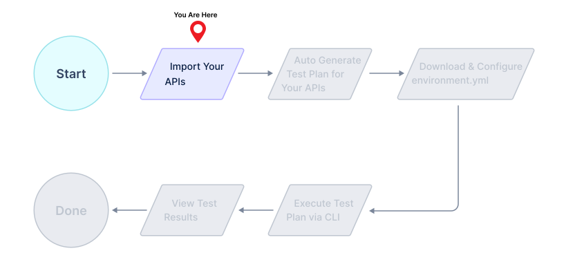

# Import API Specifications

Levo requires OpenAPI specifications for security test generation. If you already have OpenAPI specifications, you can simply import them into the API Catalog.

Otherwise OpenAPI specifications can be generated via one of the following methods:
- Auto-generate OpenAPI from live traffic via Levo's [API Observability](../../../../api-observability/api-observability.md) solution
- If you have Postman Collections, use [postman-to-openapi](https://github.com/levoai/postman-to-openapi) to generate OpenAPI from your collections
- If you have HAR files, you can contact `support@levo.ai` to have them converted to OpenAPI specifications

## 1. Import your APIs into Levo SaaS

If you are using an auto-generated `API Catalog`, pick your `Application` from the catalog and go to the next step.

1. Login into the Levo SaaS portal.

2. Click on `API Catalog` in the side panel and proceed to import you App's API specifications.

3. Select the catalog type as `Application`, and pick a suitable name for this catalog.

4. Complete the import, and verify if the API endpoints are visible in the catalog.

## 2. Upload a metadata.yml file to enable authorization bypass (RBAC) tests
If you are trying Levo for the first time, we recommend you skip this step and proceed to the next step.

If you have role based access controls (RBAC) for your APIs, and you wish to validate the proper configuration and functioning of the said controls, you will need to construct a metadata.yml file and upload it to the catalog created in the previous step.

You can read more about authorization bypass tests and the metadata.yml file [here](../../../concepts/api-catalog/metadata-yml.md).

Please construct an appropriate metadata.yml for your API endpoints and upload it via the `Metadata` tab for your API catalog in the Levo SaaS UI.

