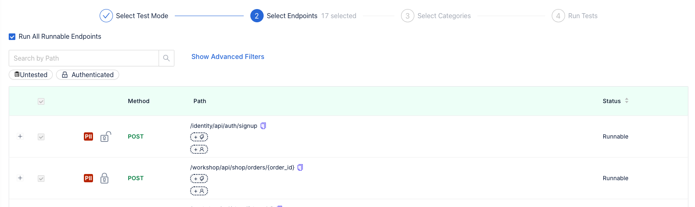

# Running Tests from Catalog

Levo provides you with the ability to run a variety of tests on your endpoints using the Test Runs feature.

The tests run on Levo's Platform, i.e., the requests to the target server are made by Levo. This means that the application must be exposed via a publicly reachable domain or IP address.

### Navigate to the `Applications` tab and choose an Application you want to run tests against.

  

### Click on the `Run Tests` button on the top right side of the screen. You can choose to  
- `Run On Cloud`: The tests will be run on Levo's cloud.
- `Run OnPrem`: The tests will run on the customer's premise. Head to the **[testrunners](testrunner.md)** page to know how and why to use **Testrunners**.

  

### Select Runnable Endpoints on the next screen.

>Note: You can configure non-runnable endpoints by manually entering sample values for mandatory parameters.

  

### Click on Next and select the categories of test you want to run from and choose from a wide variety of Tests like BOLA, SQLI, CORS, Fuzzing, etc.

  

### Enter a Target URL to run tests against, e.g. `http://crapi.levo.ai` and click on `Run Tests` to start the tests' execution.

