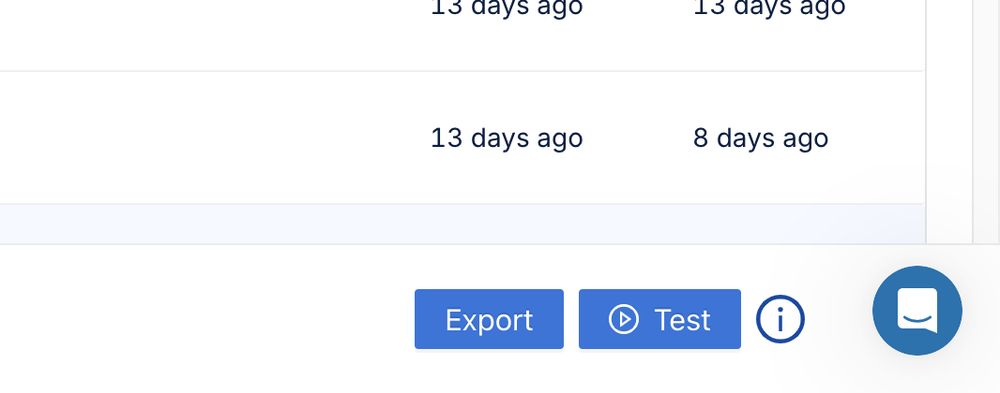

# Running Tests from Catalog

Levo provides you with the ability to run a variety of tests on your API endpoints using the Run Tests feature.

### Navigate to the `Applications` tab and choose an Application you want to run tests against.

  

### Click on the `Test` button on the bottom right side of the screen.

  

### Select Test Mode.

### Tests will run for all runnable endpoints, you can change the endpoints test parameters if needed.

>Note: You can configure non-runnable endpoints by manually entering sample values for mandatory parameters.

  

### Select the categories of test you want to run from and choose from a wide variety of Tests like BOLA, SQLI, CORS, Fuzzing, etc.

  

### Select Method and Enter a Target URL to run tests against, e.g. `http://crapi.levo.ai` and click on `Run Tests` to start the tests' execution.
- `Run on Cloud`: The tests will be run on Levo's platform, i.e., the requests to the target server are made by Levo. This means that the application must be exposed via a publicly reachable domain or IP address.
- `Run on-prem`: The tests will run on your premise. Head to the **[testrunners](testrunner.md)** page to know how to install **Testrunners**.

