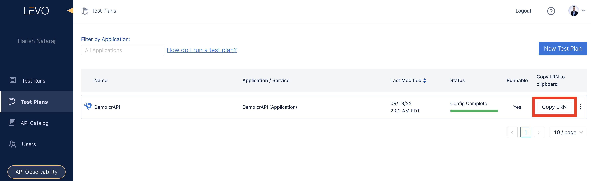

# GitHub Action
Levo's security/contract tests can be embedded in quality gates via [GitHub Actions](https://docs.github.com/en/actions).

Below are examples of embedding Levo's autogenerated tests in GitHub CI/CD via pre-built actions. You have two choices.
- [Execute Test Plans](#execute-test-plans-via-actions)
- [Execute Standalone Contract Tests](#execute-standalone-schema-conformance-tests-aka-contract-tests-via-actions)


### Execute Test Plans Via Actions

#### Prerequisites
- Forever Free Account on Levo.ai
- A runnable Levo [Test Plan](/guides/security-testing/concepts/test-plans)

#### Action Configuration

The pre-built action for executing `Test Plans` requires the following configuration settings:

- `authorization-key` : Specify your CLI authorization key here. Refer to [Generating CLI Authorization Keys](/integrations/common-tasks.md#generating-cli-authorization-keys) for instructions on fetching your key

- `organization-id` : Specify your *Organization ID* here. Refer to [Accessing Organization IDs](/integrations/common-tasks.md#accessing-organization-ids) for instructions on fetching your ID

- `target` : The base URL of the Application/API under test

- `plan` : Specify the LRN of your Levo Test Plan (from the Levo console) here. The LRN uniquely identifies the Test Plan to execute

  

- `base64_env` : This is an **OPTIONAL** setting.

  If you are using an [environment file](/guides/security-testing/test-your-app/test-app-security/data-driven/configure-env-yml) to define authentication details, you add the contents of the file here in BASE64 encoded format.

- `report` : This is an **OPTIONAL** setting.

  This setting controls the reporting of test results to the Levo Cloud. If you do not want to send test results to the Levo Cloud, set this to `false`. The default value is `true`.

- `cli_extra_args` : This is an **OPTIONAL** setting.

  Use this setting to pass extra CLI arguments like headers or the verbosity level. Please use `\\\˝` to escape quotes.

  E.g. `cli_extra_args: "-H \\\"Authorization: Bearer 1234\\\" --verbosity INFO"`

Here is a sample *Test Plan Action* with its configuration:

```YAML
- uses: levoai/actions/test-plan@v1-beta
  with:
    # Authorization key required to execute the Levo CLI. Please refer to https://app.levo.ai/settings/keys to get your authorization key.
    authorization-key: <'Specify your CLI authorization key here'>

    # The ID of your organization in Levo dashboard. Please refer to https://app.levo.ai/settings/organization to get your organization id.
    organization-id: <'Specify your organization ID here'>

    # The base URL of the Application/API under test.
    target: <'Specify the target base URL here'>

    # Test plan LRN. You can get this value from the test plan section in the Levo SaaS console.
    plan: <'Specify your Test Plan's LRN here'>

    # [OPTIONAL] Base64 encoded environment file content.
    base64_env: <'The contents of your environment file as a BASE64 encoded string here'>

    # [OPTIONAL] If you do not want to report the result of this execution to the Levo cloud, set this value to false. Default: true.
    report: <true|false>

    # [OPTIONAL] Use this option to pass extra CLI arguments like headers or verbosity.
    # Please use \\\˝ to escape quotes.
    # E.g. cli_extra_args: "-H \\\"Authorization: Bearer 1234\\\" --verbosity INFO"
    cli_extra_args: <"Specify any extra arguments here">
```

#### Job Outputs
This pre-built *Action* produces the below [Outputs](https://docs.github.com/en/actions/using-jobs/defining-outputs-for-jobs), which can be referenced by downstream Actions/Jobs.

```YAML
outputs:
  success:
    description: '# of successful test cases'
  failed:
    description: '# of failed test cases'
  skipped:
    description: '# of skipped test cases'
```


### Execute Standalone Schema Conformance Tests (aka Contract Tests) Via Actions

#### Prerequisites
- Forever Free Account on Levo.ai

#### Action Configuration

The pre-built action for executing standalone `Schema Conformance Tests` requires the following configuration settings:

- `authorization-key` : Specify your CLI authorization key here. Refer to [Generating CLI Authorization Keys](/integrations/common-tasks.md#generating-cli-authorization-keys) for instructions on fetching your key

- `organization-id` : Specify your *Organization ID* here. Refer to [Accessing Organization IDs](/integrations/common-tasks.md#accessing-organization-ids) for instructions on fetching your ID

- `schema` : The URL or file path of the (under test) API's OpenAPI schema (YAML or JSON format)

- `target` : The base URL of the Application/API under test

- `report` : This is an **OPTIONAL** setting.

  This setting controls the reporting of test results to the Levo Cloud. If you do not want to send test results to the Levo Cloud, set this to `false`. The default value is `true`.

- `cli_extra_args` : This is an **OPTIONAL** setting.

  Use this setting to pass extra CLI arguments like headers or the verbosity level. Please use `\\\˝` to escape quotes.

  E.g. `cli_extra_args: "-H \\\"Authorization: Bearer 1234\\\" --verbosity INFO"`

Here is a sample *Schema Conformance Test Action* with its configuration:

```YAML
- uses: levoai/actions/schema-conformance@v1-beta
  with:
    # Authorization key required to execute the Levo CLI. Please refer to https://app.levo.ai/settings/keys to get your authorization key.
    authorization-key: <'Specify your CLI authorization key here'>

    # The ID of your organization in the Levo dashboard. Please refer to https://app.levo.ai/settings/organization to get your organization id.
    organization-id: <'Specify your organization ID here'>

    # The URL or file path of the API's OpenAPI schema.
    schema: '<URL of schema|File path of schema>'

    # The base URL of the Application/API under test.
    target: '<Specify the target base URL here>'

    # [OPTIONAL] If you do not want to report the result of this execution to the Levo cloud, set this value to false. Default: true.
    report: <true|false>

    # [OPTIONAL] Use this option to pass extra CLI arguments like headers or verbosity.
    # Please use \\\˝ to escape quotes.
    # E.g. cli_extra_args: "-H \\\"Authorization: Bearer 1234\\\" --verbosity INFO"
    cli_extra_args: <"Specify any extra arguments here">
```

#### Job Outputs
This pre-built *Action* produces the below [Outputs](https://docs.github.com/en/actions/using-jobs/defining-outputs-for-jobs), which can be referenced by downstream Actions/Jobs.

```YAML
outputs:
  success:
    description: '# of successful test cases'
  failed:
    description: '# of failed test cases'
```

