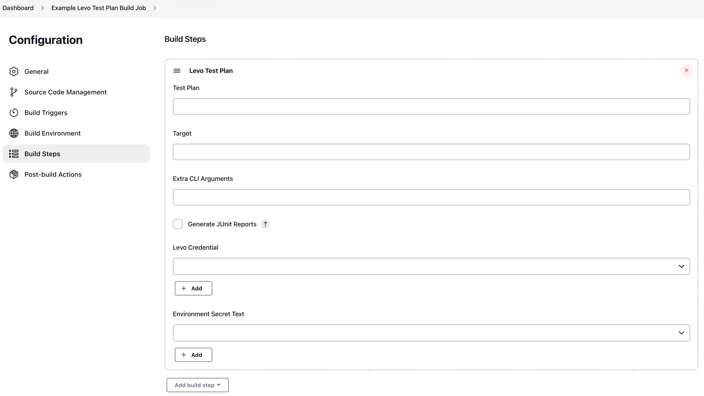

# Jenkins Plugin

Levo's security/contract tests can be embedded in Jenkins quality gates via Levo's [Jenkins plugin](https://plugins.jenkins.io/levo/).

### Prerequisites
- Forever Free Account on Levo.ai
- A runnable Levo [Test Plan](/guides/security-testing/concepts/test-plans/test-plans.md)
- A `Levo CLI Authorization Key`. Refer to instructions [here](/integrations/common-tasks.md#generating-cli-authorization-keys)

### Installation
Below are the installation options:

- [Using the GUI](https://www.jenkins.io/doc/book/managing/plugins/#from-the-web-ui): From your Jenkins dashboard navigate to `Manage Jenkins > Manage Plugins` and select the `Available` tab. Locate the plugin by searching for levo, and install it

- Using the [CLI tool](https://github.com/jenkinsci/plugin-installation-manager-tool):
    ```bash
    jenkins-plugin-cli --plugins levo:33.vc34b_8f81dc9a
    ```

- Using [direct upload](https://www.jenkins.io/doc/book/managing/plugins/#advanced-installation). Download one of the [releases](https://plugins.jenkins.io/levo/#releases) and upload it to your Jenkins instance

### Running Levo Test Plans Via Freestyle Projects (Jobs)
Follow the steps below to create a build job, that executes a Levo Test Plan against your build target.

1. Create a `Freestyle project` and name it appropriately

2. Optionally configure the `General`, `Build Triggers`, and `Build Environment` sections based on your preferences

3. Add `Levo Test Plan` build step to `Build Steps`

   

4. Configure the build step as shown below:

   

   i. `Test Plan`

   Copy the LRN of your Levo Test Plan (from the Levo console), and paste it in the Test Plan section. The LRN uniquely identifies the Test Plan to execute.

   

   ii. `Target`

   Specify the API target that needs to be tested here. This is usually the base URL of your API.

   iii. `Extra CLI Arguments` (optional)

   Please refer to the [CLI Command Reference](/security-testing/levo-cli/levo-cli-command-reference.md). Specify any optional arguments based on your preferences here.

   iv. `Generate JUnit Reports`

   If you would to generate build results (Test Plan execution results) in standard [JUnit format](https://www.ibm.com/docs/en/developer-for-zos/14.1.0?topic=formats-junit-xml-format), check the box titled `Generate JUnit Reports`.

   v. `Levo Credentials`

   You will need to specify the *Levo CLI Authorization Key* here. The Jenkins [Credentials Provider Plugin](https://plugins.jenkins.io/credentials/) is utilized to securely store the API key.

   

    - Click on the "Add" button next to the credentials dropdown
    - Select your domain
    - Select "Levo CLI Credentials" for Kind
    - Select your `Scope` based on your preferences
    - Enter your *Organization ID* in the `Organization Id` text box. Refer to [Accessing Organization IDs](/integrations/common-tasks.md#accessing-organization-ids) for instructions on fetching your ID
    - Enter your CLI authorization key in the `CLI Authorization Key` textbox. Refer to [Generating CLI Authorization Keys](/integrations/common-tasks.md#generating-cli-authorization-keys) for instructions on fetching your key
    - Click `Add` to save the credentials
    - Finally select the credential you just added

   vi. `Environment Secret Text`

   If you are using an [environment file](/guides/security-testing/test-your-app/test-app-security/data-driven/configure-env-yml) to define authentication details, you add those details as a secret file here.

   

    - Click on the "Add" button next to the *Environment Secret Text* dropdown
    - Select your domain
    - Select "Secret file" for Kind
    - Select your `Scope` based on your preferences
    - Import your `environment.yml` file using the file chooser dialog
    - Click `Add` to save the environment.yml as a secret file
    - Now select the secret file you just added

5. Optionally configure `Post-build Actions`

6. `Save/Apply` your `Freestyle Project` configuration. You are done!


