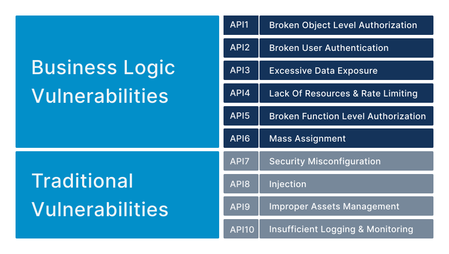

# Codeless API Security Testing

Stop vulnerabilities leaking into production and innovate faster!

Levo lets modern development teams ship fast, and NOT compromise on quality & security.

## Comprehensive API Security Coverage
Levo’s purpose-built *API Security Testing* solution, comprehends your unique business logic and provides comprehensive coverage for OWASP API 10, Business Logic Vulnerabilities, and Privilege Escalation Vulnerabilities.

Levo is purpose built to tackle business logic vulnerabilities accentuated by APIs, such as [Horizontal Privilege Escalation](/vulnerabilities/v1/OWASP-API-10/A1-BOLA), and [Vertical Privilege Escalation](/vulnerabilities/v1/OWASP-API-10/A5-BFLA).

## Shift Left by Embedding API Security Testing in CI/CD

Levo auto-generates and orchestrates, codeless API Security Tests in CI/CD.

You can embed Levo's contract tests in various stages of your software delivery pipeline via CI/CD Quality Gates.

## Codeless Automated API Testing Framework

Modeled akin to popular API testing frameworks such Postman/Newman, Katlan, etc., the framework supports rapid testing of APIs using either auto generated data, or customer provisioned data.

## Actionable Reports

Levo provides high fidelity, low noise, and jargon free (vulnerability) findings that are targeted for direct consumption by development teams.

Findings have detailed API traffic logs that aid in better comprehension, and problem reproduction.

Levo provides contextual remediation help for development teams to address issues via self service.