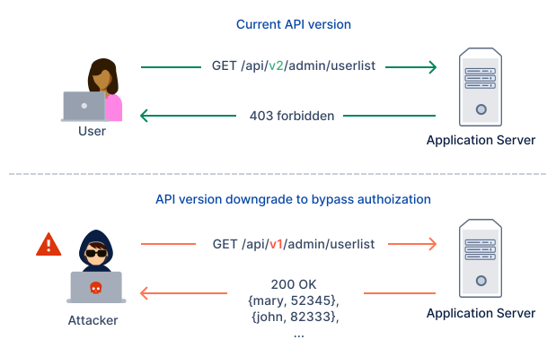

# API A9 - Improper Asset Management

## What is it?
Attackers find non-production, and/or older versions of the API (for example, staging, testing, beta, or earlier versions) that are not as well protected as the production API, and use those to launch their attacks.

## What are specific examples?
    
In the diagram above v2 of `/api/v2/admin/userlist` only allows properly authenticated `admins` to access the API endpoint.

The `v1` version does not check if the user calling the API endpoint is actually an `admin`, allowing any user to retrieve details on all users in the application.

This is a serious privilege escalation vulnerability as details of all users including sensitive data about them is exposed.

## References
[OWASP API TOP-10 A9](https://owasp.org/www-project-api-security/)  
[Improper Asset Management - Cheat Sheet](https://github.com/OWASP/API-Security/blob/master/2019/en/src/0xa9-improper-assets-management.md)

## Test case FAQs

### When is this test case applicable?
* Applicable to all API endpoints.

## How does it work?
- For the API endpoint under test, multiple version routes (/v1/, /v2/), are automatically probed and accessed without the proper authentication credentials. The test case will raise appropriate alerts if these routes respond positively.

- Similarly the presence of an admin route (/admin/) is probed, and accessed without the proper authentication credentials. Appropriate alerts are raised, if the route responds positively.

- Route word lists are all used to probe for the presence of commonly used administrative routes. Appropriate alerts are raised, if the route responds positively.

## What is the solution?
- Keep an up-to-date inventory all API hosts.
- Limit access to API endpoints that should not be public.
- Limit access to production data, and segregate access to production and non-production data.
- Properly retire old versions of APIs or backport security fixes to them.
- Implement strict authentication, redirects, and CORS checks for all API endpoints.

